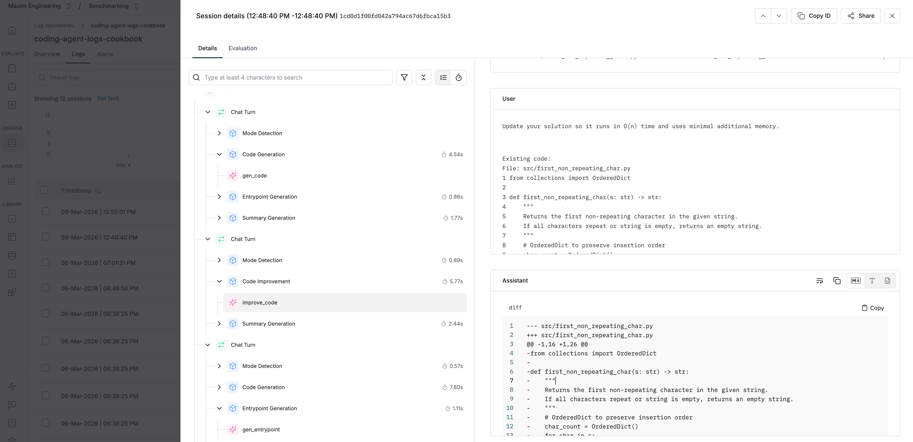
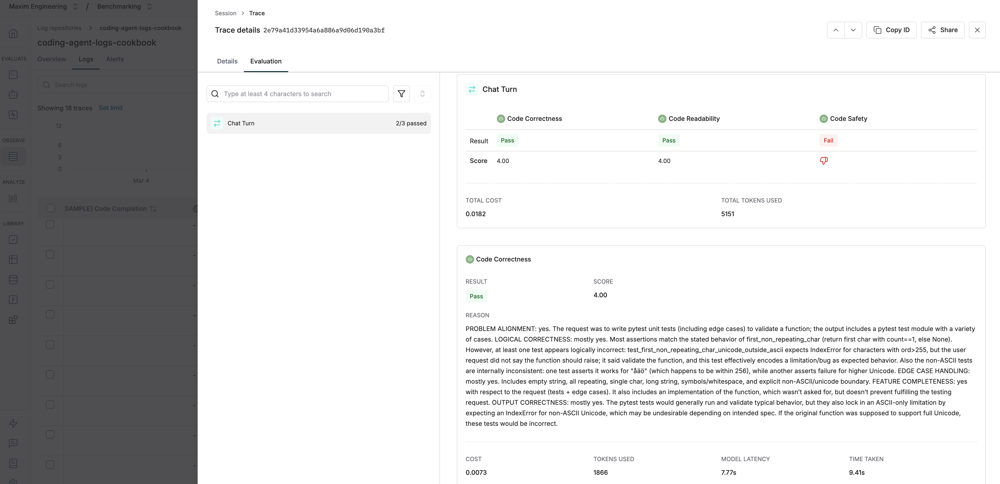
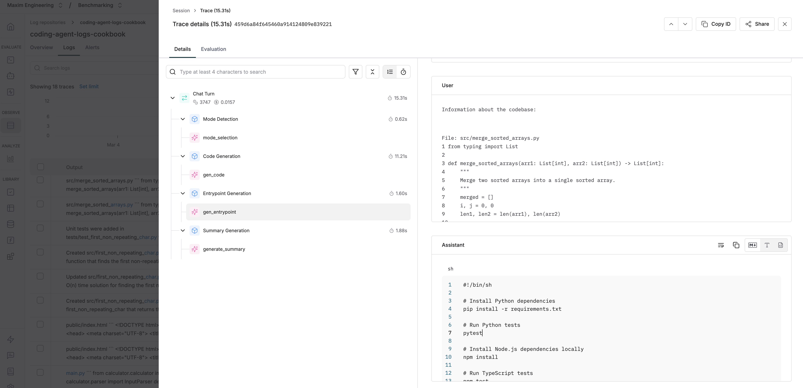

# Coding Agent with Maxim Observability

A multi-turn coding agent that auto-detects mode (generate/improve/debug), maintains session state, and has 5 evaluators wired via the Maxim SDK so every trace is evaluated automatically.

## How It Works

A single `/chat` endpoint accepts user messages with a `session_id`. The agent:

1. **Detects mode** — Uses an LLM call to classify the request as `generate`, `improve`, or `debug`
2. **Executes** — Generates new code, applies diffs to existing code, or runs a debug loop with auto-fix
3. **Evaluates** — Attaches 5 evaluators to the trace via the Maxim SDK
4. **Returns** — Files, mode, summary, and trace ID



## Prerequisites

- Python 3.11+
- OpenAI API key
- Maxim account with:
  - A log repository
  - 5 evaluators configured (see [evaluators.md](evaluators.md))

## Setup

```bash
# Clone the repository
git clone <repo-url>
cd python/observability-online-eval/coding-agent

# Copy and fill in environment variables
cp .env.example .env
# Edit .env with your keys

# Install dependencies
uv sync
# or
pip install -e .
```

### Configure Evaluators

Two evaluators are built-in and auto-installed in Maxim:
- **Code Completeness** (scale 1-5)
- **Code Language Selection** (binary 0/1)

Three must be created as custom evaluators on the [Maxim platform](https://app.getmaxim.ai):
- **Code Correctness** (scale 1-5) — see [evaluators.md](evaluators.md#3-code-correctness-custom-scale-1-5)
- **Code Safety** (binary 0/1) — see [evaluators.md](evaluators.md#4-code-safety-custom-binary-01)
- **Code Readability** (scale 1-5) — see [evaluators.md](evaluators.md#5-code-readability-custom-scale-1-5)



## Run

### Terminal Chat (quickest way to try)

```bash
python cli.py
```

This starts an interactive REPL — just type your requests and the agent responds. Session state is maintained across turns so you can generate, then improve, then debug in sequence.

### API Server

```bash
uvicorn app:app --reload --port 8000
```

## Try It

### Terminal

```
$ python cli.py
Coding Agent (type 'quit' to exit)
Session: a1b2c3...
----------------------------------------

You: build a calculator in python

[generate] Created a Python calculator with main.py, calculator.py, and tests...

Files (4):
  - main.py
  - calculator.py
  - requirements.txt
  - tests/test_calculator.py

You: add square root support

[improve] Added math.sqrt import and square root operator...

You: quit
Goodbye!
```

### curl

#### 1. Generate (new session)

```bash
curl -X POST http://localhost:8000/chat \
  -H "Content-Type: application/json" \
  -d '{"session_id": "test", "message": "build a calculator in python"}'
```

### 2. Improve (same session)

```bash
curl -X POST http://localhost:8000/chat \
  -H "Content-Type: application/json" \
  -d '{"session_id": "test", "message": "add square root support"}'
```

### 3. Debug (same session)

```bash
curl -X POST http://localhost:8000/chat \
  -H "Content-Type: application/json" \
  -d '{"session_id": "test", "message": "its crashing on negative numbers, fix it"}'
```

### 4. Check session state

```bash
curl http://localhost:8000/session/test
```



## Project Structure

```
python/observability-online-eval/coding-agent/
+-- README.md                  # This file
+-- coding_agent/
|   +-- __init__.py
|   +-- agent.py               # CodingAgent: mode detection + 3 modes
|   +-- ai.py                  # OpenAI SDK wrapper + compaction
|   +-- observability.py       # Maxim tracing + evaluator wiring
|   +-- files.py               # FilesDict + parse LLM output + diffs
|   +-- execution.py           # Subprocess code execution
|   +-- prompts/
|       +-- roadmap            # High-level instruction
|       +-- generate           # Code generation prompt
|       +-- improve            # Code improvement prompt
|       +-- philosophy         # Coding style guidelines
|       +-- file_format        # Output format for new files
|       +-- file_format_diff   # Output format for diffs
|       +-- file_format_fix    # Output format for fixes
|       +-- entrypoint         # run.sh generation prompt
|       +-- mode_selection     # Mode classification prompt
+-- app.py                     # FastAPI: POST /chat + sessions
+-- cli.py                     # Terminal chat interface (REPL)
+-- pyproject.toml             # Dependencies
+-- .env.example               # Environment variable template
+-- evaluators.md              # 5 evaluator reference (prompts + scoring)
```
